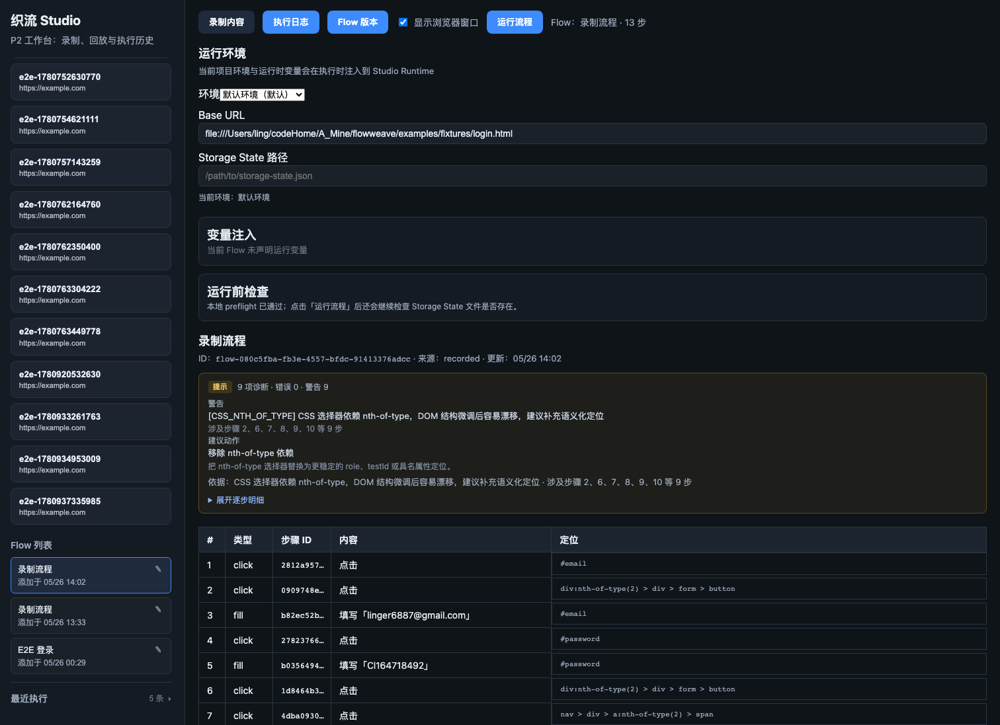
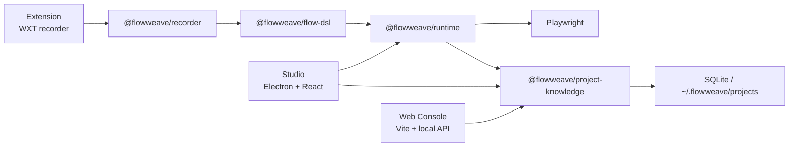

# FlowWeave

[Landing README](./README.md) | [简体中文](./README.zh-CN.md)


FlowWeave is a local-first web automation and page intelligence platform.

Instead of acting like a one-off browser macro recorder, it turns real browser interactions into executable, maintainable, diagnosable, versioned workflow assets.

## Studio Preview



## What FlowWeave Is For

The current mainline focuses on one practical loop:

1. Record real browser interactions with the extension.
2. Sync the result into a local knowledge base as normalized flows.
3. Replay and diagnose flows through a Playwright-based runtime.
4. Inspect projects, flows, versions, and execution history in Studio and Web.

In short, FlowWeave is building a reliable local workbench for web automation, not just a click recorder.

## Current Scope

### Included

- Monorepo foundation with `pnpm workspaces`, `Turborepo`, and strict TypeScript
- Flow DSL for normalized workflow contracts and schema evolution
- WXT browser extension for recording and local sync
- Playwright runtime with screenshots, page snapshots, HAR artifacts, and structured diagnostics
- Electron Studio for flow replay, execution history, flow versions, and debugging details
- Web console plus local API
- SQLite-backed project knowledge under `~/.flowweave/projects/`
- Mainline verification commands such as `pnpm doctor`, `pnpm smoke`, and `pnpm e2e:login`

### Stable Baseline

- Current mainline phase: `P2` hardening / v1 walking-skeleton maintenance
- Default local development baseline: Node `24` from [`.nvmrc`](./.nvmrc)
- Compatibility baseline retained: Node `20`
- Recorded replay baseline: `25 = 23 fixture + 2 runtime-generated`
- Recent hardening includes Studio layout contracts, ambiguity diagnostics, Electron bundle integrity, and headed browser sizing fixes

### Explicitly Out of Scope Right Now

- `P3` deep page / network intelligence expansion
- `P4` AI orchestration productization and related UI
- Cloud collaboration, multi-user sync, or a new tech stack rewrite

The active route lock and acceptance gates live in [PROJECT_ROUTE_LOCK.md](./PROJECT_ROUTE_LOCK.md).

## Architecture Snapshot



## Tech Stack

| Area              | Choice                  |
| ----------------- | ----------------------- |
| Language          | TypeScript strict       |
| Monorepo          | pnpm + Turborepo        |
| Workflow contract | Zod Flow DSL            |
| Execution engine  | Playwright              |
| Desktop app       | Electron + Vite + React |
| Web app           | Vite + local API        |
| Local storage     | SQLite + Drizzle        |
| Extension         | WXT                     |

## Quick Start

### 1. Install

```bash
corepack enable
pnpm install
```

Run the environment check on a fresh machine:

```bash
pnpm doctor
```

If Playwright Chromium is missing:

```bash
pnpm --filter @flowweave/runtime exec playwright install chromium
```

### Local macOS Preview Installer

```bash
pnpm --filter @flowweave/app-studio package:mac
```

The DMG bundles the matching Playwright Chromium and Studio uses the local knowledge store without requiring the Web API. This artifact is ad-hoc signed for local or internal validation only; public distribution still requires a Developer ID signature, Apple notarization, and a final app icon.

### 2. Verify the Mainline

```bash
pnpm smoke
```

`pnpm smoke` runs:

- `pnpm smoke:prepare`
- `pnpm typecheck`
- `pnpm test`
- `pnpm build`
- `pnpm e2e:login` by default

If you want compilation and tests without the UI replay step:

```bash
SKIP_E2E=1 pnpm smoke
```

### 3. Start the Development Environment

You will usually want two terminals:

Terminal A:

```bash
pnpm dev:web
```

- Web console: <http://127.0.0.1:5174>
- Local API: <http://127.0.0.1:3847>
- Health check: <http://127.0.0.1:3847/api/health>

Terminal B:

```bash
pnpm dev:studio
```

If you also want extension development:

```bash
pnpm dev:extension
```

### 4. Typical Workflow

1. Start `pnpm dev:web`
2. Start `pnpm dev:studio`
3. Load the extension from `apps/extension/dist/chrome-mv3`
4. Record a real page interaction and sync it into the knowledge base
5. Replay the flow in Studio
6. Inspect flow and execution history in Web

See [docs/guides/quickstart.md](./docs/guides/quickstart.md) for the full path.

## Common Commands

```bash
pnpm doctor
pnpm smoke
pnpm smoke:full
pnpm typecheck
pnpm lint
pnpm test
pnpm build
pnpm e2e:login
pnpm e2e:recorded-pages
pnpm e2e:real-pages
pnpm dev:web
pnpm dev:studio
pnpm dev:extension
```

## Node Version Policy

- `engines.node` is `>=20`
- The default stable local baseline is Node `24`
- GitHub Actions keeps a Node `20 / 24` matrix
- If you switch between Node `20` and `24`, run:

```bash
pnpm install --force
```

This rebuilds native modules such as `better-sqlite3` for the active Node ABI.

## Repository Layout

```text
flowweave/
├── apps/
│   ├── extension/         # browser extension recorder
│   ├── studio/            # Electron desktop studio
│   └── web/               # web console + local API
├── packages/
│   ├── shared/            # shared errors, constants, helpers
│   ├── flow-dsl/          # flow schema and step contracts
│   ├── recorder/          # recording normalization
│   ├── runtime/           # Playwright execution engine
│   ├── project-knowledge/ # SQLite-backed knowledge base
│   ├── page-intelligence/
│   ├── network-intelligence/
│   ├── ai-orchestrator/
│   └── ui/
├── docs/
├── examples/
├── PROJECT_ROUTE_LOCK.md
├── AGENTS.md
└── CONTRIBUTING.md
```

## Core Packages

| Package                           | Responsibility                                                  |
| --------------------------------- | --------------------------------------------------------------- |
| `@flowweave/flow-dsl`             | Flow DSL, step models, schema evolution                         |
| `@flowweave/recorder`             | Recording normalization and target hint preservation            |
| `@flowweave/runtime`              | Execution, waits, recovery, diagnostics, screenshots, artifacts |
| `@flowweave/project-knowledge`    | Projects, flows, versions, execution history, local storage     |
| `@flowweave/page-intelligence`    | Page snapshot and structure analysis foundations                |
| `@flowweave/network-intelligence` | Network-side capability skeleton                                |
| `@flowweave/shared`               | Shared errors, constants, and utilities                         |

## Data and Artifacts

- Local project data: `~/.flowweave/projects/<projectId>/`
- Execution artifacts: `runs/<executionId>/`
- Typical outputs include:
  - `step-*.png`
  - page snapshot JSON
  - HAR files
  - structured diagnostics

## Current Verification Gates

The README is aligned with the active route lock. The current mainline expects at least:

- `pnpm lint`
- `pnpm smoke`
- `pnpm e2e:recorded-pages`
- `pnpm build`
- `pnpm --filter @flowweave/app-studio build`
- local Studio desktop launch on the current machine

For manual acceptance, see [docs/guides/manual-qa.md](./docs/guides/manual-qa.md).

## Documentation Map

| Document                                                                                                           | Purpose                                   |
| ------------------------------------------------------------------------------------------------------------------ | ----------------------------------------- |
| [PROJECT_ROUTE_LOCK.md](./PROJECT_ROUTE_LOCK.md)                                                                   | active route lock, DoD, frozen boundaries |
| [docs/guides/quickstart.md](./docs/guides/quickstart.md)                                                           | get the mainline running locally          |
| [docs/architecture/overview.md](./docs/architecture/overview.md)                                                   | architecture and package dependency rules |
| [docs/domain/flow-dsl.md](./docs/domain/flow-dsl.md)                                                               | Flow DSL contract                         |
| [docs/releases/v1.0.0.md](./docs/releases/v1.0.0.md)                                                               | v1 capability scope                       |
| [docs/guides/manual-qa.md](./docs/guides/manual-qa.md)                                                             | manual QA and acceptance checklist        |
| [docs/superpowers/plans/2026-05-26-run-first-roadmap.md](./docs/superpowers/plans/2026-05-26-run-first-roadmap.md) | current execution roadmap                 |
| [docs/adr/README.md](./docs/adr/README.md)                                                                         | architecture decision records             |
| [CONTRIBUTING.md](./CONTRIBUTING.md)                                                                               | contribution guide                        |
| [AGENTS.md](./AGENTS.md)                                                                                           | AI / developer collaboration rules        |

## Contributing and Collaboration

- Recommended reading before changes:
  - [PROJECT_ROUTE_LOCK.md](./PROJECT_ROUTE_LOCK.md)
  - [docs/guides/quickstart.md](./docs/guides/quickstart.md)
  - [docs/architecture/overview.md](./docs/architecture/overview.md)
- See [AGENTS.md](./AGENTS.md) for collaboration rules
- See [CONTRIBUTING.md](./CONTRIBUTING.md) for standard contribution guidance

## Chinese Version

For the full Chinese version, read [README.zh-CN.md](./README.zh-CN.md).
