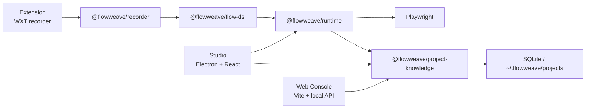

# FlowWeave / 织流

[简体中文](./README.zh-CN.md) | [English](./README.en.md)


FlowWeave is a local-first web automation and page intelligence platform. It turns recorded browser interactions into executable, diagnosable, versioned workflow assets.

织流是一个本地优先的网页流程自动化与页面智能分析平台。它不是只做“网页点击录制”，而是把页面操作逐步沉淀为可执行、可维护、可诊断、可复验的 Flow 资产。

## Studio Preview / 界面预览


## Highlights / 核心能力

- Browser extension recording and local knowledge sync
- Playwright-based runtime with diagnostics, recovery, screenshots, and replay artifacts
- Electron Studio for replay, execution history, flow versions, and debugging details
- Web console plus local API for project, flow, and execution browsing
- SQLite-backed project knowledge stored under `~/.flowweave/projects/`
- Current recorded replay baseline: `25 = 23 fixture + 2 runtime-generated`

## Current Status / 当前状态

- Mainline phase: `P2` hardening and documentation consolidation
- Default local development baseline: Node `24` from [`.nvmrc`](./.nvmrc)
- Compatibility baseline retained: Node `20`
- Studio desktop build and local launch are part of the current acceptance gate
- `P3` deep intelligence expansion and `P4` AI productization remain frozen

See [PROJECT_ROUTE_LOCK.md](./PROJECT_ROUTE_LOCK.md) for the active route lock and acceptance gates.

## Architecture Snapshot / 架构快照



## Quick Start / 快速开始

```bash
corepack enable
pnpm install
pnpm doctor
pnpm smoke
```

If Playwright Chromium is missing on a fresh machine:

```bash
pnpm --filter @flowweave/runtime exec playwright install chromium
```

Start local services:

```bash
pnpm dev:web
pnpm dev:studio
pnpm dev:extension
```

Build a local macOS preview installer / 构建 macOS 本地预览安装包：

```bash
pnpm --filter @flowweave/app-studio package:mac
```

The DMG includes the matching Playwright Chromium. Developer ID signing, notarization, and the final app icon remain release prerequisites. / DMG 已包含匹配版本的 Playwright Chromium；Developer ID 签名、Apple 公证和正式图标仍是公开发布前置条件。

## Repository Map / 仓库结构

```text
flowweave/
├── apps/
│   ├── extension/   # WXT browser extension recorder
│   ├── studio/      # Electron desktop studio
│   └── web/         # Web console + local API
├── packages/
│   ├── flow-dsl/
│   ├── recorder/
│   ├── runtime/
│   ├── project-knowledge/
│   ├── page-intelligence/
│   ├── network-intelligence/
│   ├── ai-orchestrator/
│   ├── shared/
│   └── ui/
├── docs/
├── PROJECT_ROUTE_LOCK.md
├── AGENTS.md
└── CONTRIBUTING.md
```

## Documentation / 文档入口

- [README.zh-CN.md](./README.zh-CN.md): full Chinese overview
- [README.en.md](./README.en.md): full English overview
- [docs/guides/quickstart.md](./docs/guides/quickstart.md): run the mainline locally
- [docs/architecture/overview.md](./docs/architecture/overview.md): architecture and package dependencies
- [docs/domain/flow-dsl.md](./docs/domain/flow-dsl.md): Flow DSL contract
- [docs/releases/v1.0.0.md](./docs/releases/v1.0.0.md): v1 scope
- [docs/guides/manual-qa.md](./docs/guides/manual-qa.md): manual acceptance checklist

## Read in Your Language / 按语言阅读

- Chinese: [README.zh-CN.md](./README.zh-CN.md)
- English: [README.en.md](./README.en.md)
