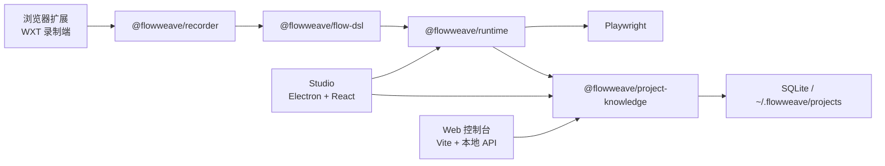

# 织流 / FlowWeave

[入口 README](./README.md) | [English](./README.en.md)


织流（FlowWeave）是一个本地优先的网页流程自动化与页面智能分析平台。

它的目标不是简单录制网页点击，而是把网页项目逐步沉淀为可执行、可维护、可诊断、可复验、可版本化的自动化资产。

## 界面预览


## 项目定位

FlowWeave 目前聚焦一条清晰主线：

1. 用浏览器扩展录制真实页面操作。
2. 把录制结果同步到本地知识库，沉淀为标准化 Flow。
3. 用 Playwright 执行引擎进行回放、诊断、截图与运行产物归档。
4. 用 Studio 和 Web 控制台查看项目、Flow、执行历史与版本信息。

这意味着它更接近“可维护的本地网页自动化工作台”，而不是一次性的脚本录制器。

## 当前能力范围

### 已包含

- Monorepo 工程体系：`pnpm workspaces + Turborepo + TypeScript strict`
- Flow DSL：标准化流程 Schema、步骤结构与版本化演进
- 浏览器扩展录制：WXT + 本地 API 同步
- Runtime 执行引擎：Playwright 回放、截图、页面快照、HAR、结构化诊断
- Studio 桌面端：Flow 选择、运行、执行历史、Flow 版本、诊断详情
- Web 控制台：项目、Flow、执行历史浏览
- 项目知识库：SQLite 本地存储，默认位于 `~/.flowweave/projects/`
- 主线验证命令：`pnpm doctor`、`pnpm smoke`、`pnpm e2e:login`

### 当前稳定口径

- 当前主线阶段：`P2` 稳定化收口 / v1 先跑通版维护
- 默认本地开发基线：Node `24`（见 [`.nvmrc`](./.nvmrc)）
- 兼容保留：Node `20`
- recorded replay 稳定基线：`25 = 23 fixture + 2 runtime-generated`
- Studio 已收口布局 contract、歧义候选诊断、Electron bundle integrity 与 headed 浏览器尺寸策略

### 当前明确不做

- `P3` 深度 page / network intelligence 扩展
- `P4` AI 编排产品化与对应 UI
- 云端协作、多用户同步、全新技术栈替换

项目主线、阶段出口与冻结边界以 [PROJECT_ROUTE_LOCK.md](./PROJECT_ROUTE_LOCK.md) 为准。

## 架构快照



## 技术栈

| 领域     | 选型                    |
| -------- | ----------------------- |
| 语言     | TypeScript strict       |
| Monorepo | pnpm + Turborepo        |
| 流程契约 | Zod Flow DSL            |
| 执行内核 | Playwright              |
| 桌面端   | Electron + Vite + React |
| Web      | Vite + 本地 API         |
| 本地存储 | SQLite + Drizzle        |
| 扩展     | WXT                     |

## 快速开始

### 1. 安装

```bash
corepack enable
pnpm install
```

如果是首次 clone，建议先跑环境自检：

```bash
pnpm doctor
```

如果 `pnpm doctor` 提示缺失 Playwright Chromium，执行：

```bash
pnpm --filter @flowweave/runtime exec playwright install chromium
```

### macOS 本地预览安装包

```bash
pnpm --filter @flowweave/app-studio package:mac
```

DMG 会包含匹配版本的 Playwright Chromium，可在不启动 Web API 的情况下使用 Studio 本地知识库。当前产物采用 ad-hoc 签名，仅用于本机或内部验收；公开分发前仍需 Developer ID 签名、Apple 公证和正式应用图标。

### 2. 一键验证主链路

```bash
pnpm smoke
```

`pnpm smoke` 会串起：

- `pnpm smoke:prepare`
- `pnpm typecheck`
- `pnpm test`
- `pnpm build`
- `pnpm e2e:login`（默认不跳过）

只想先验证编译与测试时，可以使用：

```bash
SKIP_E2E=1 pnpm smoke
```

### 3. 启动开发环境

通常需要两个终端：

终端 A：

```bash
pnpm dev:web
```

- Web 控制台：<http://127.0.0.1:5174>
- 本地 API：<http://127.0.0.1:3847>
- 健康检查：<http://127.0.0.1:3847/api/health>

终端 B：

```bash
pnpm dev:studio
```

如需调试扩展，再额外启动：

```bash
pnpm dev:extension
```

### 4. 典型使用路径

1. 启动 `pnpm dev:web`
2. 启动 `pnpm dev:studio`
3. 加载扩展 `apps/extension/dist/chrome-mv3`
4. 在真实网页中录制操作并同步到知识库
5. 在 Studio 中选择项目与 Flow 执行回放
6. 在 Web 中查看 Flow 与执行历史

完整步骤见 [docs/guides/quickstart.md](./docs/guides/quickstart.md)。

## 常用命令

```bash
pnpm doctor
pnpm smoke
pnpm smoke:full
pnpm typecheck
pnpm lint
pnpm test
pnpm build
pnpm e2e:login
pnpm e2e:recorded-pages
pnpm e2e:real-pages
pnpm dev:web
pnpm dev:studio
pnpm dev:extension
```

## Node 版本说明

- `engines.node` 为 `>=20`
- 当前默认稳定开发基线是 Node `24`
- GitHub Actions 保持 Node `20 / 24` 双矩阵
- 若在 Node `20` 与 `24` 之间切换，建议执行一次：

```bash
pnpm install --force
```

这样可以让 `better-sqlite3` 等原生模块按当前 Node ABI 重新安装。

## 仓库结构

```text
flowweave/
├── apps/
│   ├── extension/        # 浏览器扩展录制端
│   ├── studio/           # Electron 桌面工作台
│   └── web/              # Web 控制台 + 本地 API
├── packages/
│   ├── shared/           # 错误码、常量、通用工具
│   ├── flow-dsl/         # Flow Schema 与步骤契约
│   ├── recorder/         # 录制数据标准化
│   ├── runtime/          # Playwright 执行引擎
│   ├── project-knowledge/ # SQLite 项目知识库
│   ├── page-intelligence/
│   ├── network-intelligence/
│   ├── ai-orchestrator/
│   └── ui/
├── docs/
├── examples/
├── PROJECT_ROUTE_LOCK.md
├── AGENTS.md
└── CONTRIBUTING.md
```

## 核心包说明

| 包                                | 作用                                       |
| --------------------------------- | ------------------------------------------ |
| `@flowweave/flow-dsl`             | Flow DSL、步骤模型、版本化契约             |
| `@flowweave/recorder`             | 录制结果归一化与目标信息保真               |
| `@flowweave/runtime`              | 执行、等待、恢复、诊断、截图与运行产物     |
| `@flowweave/project-knowledge`    | 项目、Flow、版本、执行历史、本地知识库存储 |
| `@flowweave/page-intelligence`    | 页面快照与结构分析基础能力                 |
| `@flowweave/network-intelligence` | 网络侧基础能力骨架                         |
| `@flowweave/shared`               | 错误码、常量、共享工具                     |

## 数据与运行产物

- 本地项目数据：`~/.flowweave/projects/<projectId>/`
- 脚本与运行产物：`runs/<executionId>/`
- 典型产物包括：
  - `step-*.png`
  - 页面快照 JSON
  - HAR 文件
  - 结构化诊断信息

## 当前验证门禁

当前 README 与项目路线锁保持一致，主线交付至少要覆盖：

- `pnpm lint`
- `pnpm smoke`
- `pnpm e2e:recorded-pages`
- `pnpm build`
- `pnpm --filter @flowweave/app-studio build`
- Studio 桌面端本机可启动

更完整的人工验收请看 [docs/guides/manual-qa.md](./docs/guides/manual-qa.md)。

## 文档入口

| 文档                                                                                                               | 用途                      |
| ------------------------------------------------------------------------------------------------------------------ | ------------------------- |
| [PROJECT_ROUTE_LOCK.md](./PROJECT_ROUTE_LOCK.md)                                                                   | 当前路线锁、DoD、冻结边界 |
| [docs/guides/quickstart.md](./docs/guides/quickstart.md)                                                           | 本地快速跑通              |
| [docs/architecture/overview.md](./docs/architecture/overview.md)                                                   | 架构与包依赖规则          |
| [docs/domain/flow-dsl.md](./docs/domain/flow-dsl.md)                                                               | Flow DSL 规范             |
| [docs/releases/v1.0.0.md](./docs/releases/v1.0.0.md)                                                               | v1 能力范围               |
| [docs/guides/manual-qa.md](./docs/guides/manual-qa.md)                                                             | 手测与验收清单            |
| [docs/superpowers/plans/2026-05-26-run-first-roadmap.md](./docs/superpowers/plans/2026-05-26-run-first-roadmap.md) | 当前执行主路线            |
| [docs/adr/README.md](./docs/adr/README.md)                                                                         | 架构决策记录              |
| [CONTRIBUTING.md](./CONTRIBUTING.md)                                                                               | 贡献方式                  |
| [AGENTS.md](./AGENTS.md)                                                                                           | AI / 开发者协作规则       |

## 贡献与协作

- 开发前建议先读：
  - [PROJECT_ROUTE_LOCK.md](./PROJECT_ROUTE_LOCK.md)
  - [docs/guides/quickstart.md](./docs/guides/quickstart.md)
  - [docs/architecture/overview.md](./docs/architecture/overview.md)
- 协作规范见 [AGENTS.md](./AGENTS.md)
- 常规贡献说明见 [CONTRIBUTING.md](./CONTRIBUTING.md)

## 英文版

如需英文说明，请阅读 [README.en.md](./README.en.md)。
