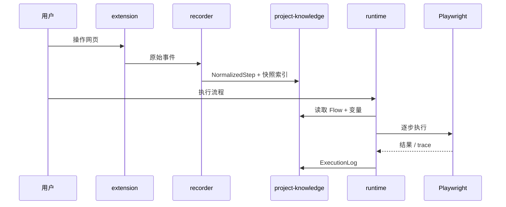

# FlowWeave 架构总览

> 版本：0.1.1 · 更新：2026-06-09

## 1. 产品与技术目标

织流（FlowWeave）是**通用网页流程自动化与页面智能分析平台**。技术架构服务于以下目标：

1. 把录制结果沉淀为可版本化、可参数化的流程资产（Flow DSL）。
2. 以 Playwright 为执行内核，在上层实现定位策略、重试、诊断与自愈。
3. 以 Project 为聚合根，统一存储页面知识、接口知识、流程与执行记录。
4. 三端（扩展 / 桌面 / Web）共享同一套领域包，避免重复实现引擎。

## 1.1 当前稳定基线（2026-06-09）

- 当前路线锁：[`PROJECT_ROUTE_LOCK.md`](../../PROJECT_ROUTE_LOCK.md)
- 当前执行主线：[`docs/superpowers/plans/2026-05-26-run-first-roadmap.md`](../superpowers/plans/2026-05-26-run-first-roadmap.md)
- 当前稳定口径：
  - 本地自验默认以 Node 24 为准，GitHub Actions 兼容覆盖 Node 20 / 24
  - recorded replay 基线为 `25 = 23 fixture + 2 runtime-generated`
  - Studio 已补齐布局 contract、歧义候选诊断与 Electron bundle integrity 收口
- 当前冻结边界：
  - P3 仅保留现有基础能力，不继续扩展深度 page / network intelligence
  - P4 `ai-orchestrator` 保留包骨架，不接入 Studio / 扩展 / Web

## 2. 逻辑架构

```mermaid
flowchart TB
  subgraph apps [应用层]
    EXT[apps/extension]
    STU[apps/studio]
    WEB[apps/web]
  end

  subgraph packages [领域与引擎层]
    SH[@flowweave/shared]
    DSL[@flowweave/flow-dsl]
    REC[@flowweave/recorder]
    RUN[@flowweave/runtime]
    PI[@flowweave/page-intelligence]
    NET[@flowweave/network-intelligence]
    PK[@flowweave/project-knowledge]
    AI[@flowweave/ai-orchestrator]
    UI[@flowweave/ui]
  end

  subgraph infra [基础设施]
    PW[Playwright]
    DB[(SQLite)]
    FS[文件资产库]
    LLM[AI SDK]
  end

  EXT --> REC
  STU --> RUN
  STU --> PK
  STU --> UI
  WEB --> PK
  WEB --> UI
  REC --> DSL
  REC --> SH
  RUN --> DSL
  RUN --> REC
  RUN --> PI
  RUN --> PK
  PI --> PK
  NET --> PK
  AI --> PK
  AI --> PI
  AI --> RUN
  RUN --> PW
  PK --> DB
  PK --> FS
  AI --> LLM
```

## 3. 包依赖规则（强制）

| 规则 | 说明 |
|------|------|
| 应用只依赖包 | `apps/*` 不得互相依赖 |
| `shared` 无上游业务依赖 | 仅类型、Schema、错误码、工具 |
| `flow-dsl` 仅依赖 `shared` | 流程 AST 与版本迁移 |
| `runtime` 不依赖 `ai-orchestrator` | AI 通过编排层调用 runtime |
| `ai-orchestrator` 不直接操作浏览器 | 执行一律经 `runtime` |
| 禁止循环依赖 | CI 通过 dependency-cruiser 或 turbo 图校验 |

## 4. 物理目录

```text
flowweave/
├── apps/
│   ├── extension/     # WXT + MV3 录制端
│   ├── studio/        # Electron 工作台
│   └── web/           # Vite SPA 控制台（Phase 2 加强）
├── packages/
│   ├── shared/
│   ├── flow-dsl/
│   ├── recorder/
│   ├── runtime/
│   ├── page-intelligence/
│   ├── network-intelligence/
│   ├── project-knowledge/
│   ├── ai-orchestrator/
│   └── ui/
├── docs/
│   ├── architecture/  # 本文档
│   ├── adr/           # 架构决策记录
│   └── domain/        # 领域规范（Flow DSL 等）
└── examples/
```

## 5. 核心领域模型

以 **Project** 为聚合根：

```text
Project
├── environments[]     # 环境、鉴权、入口 URL
├── pages[]            # 页面知识、区域、元素指纹
├── networks[]         # 接口模板、参数来源
├── flows[]            # Flow DSL（含 schemaVersion）
├── executions[]       # 运行实例、步骤日志
└── insights[]         # 体检、AI 建议、修复记录
```

Flow 三层模型：

1. **RecordedEvent** — 扩展原始事件（短期、可丢弃）
2. **NormalizedStep** — 平台标准步骤（持久化）
3. **ExecutablePlan** — 带定位链、超时、重试的执行计划（runtime 消费）

## 6. 数据流（MVP）



## 7. 分阶段交付

| 阶段 | 目标 | 关键包 | 当前状态 |
|------|------|--------|----------|
| P0 | 工程基座、规范、CI | shared、工具链 | ✅ 已完成 |
| P1 | 录制 + 回放闭环 | recorder、flow-dsl、runtime、extension、studio | ✅ 已完成 |
| P2 | 知识库 + 调试回放 + 真实页面稳定性 | project-knowledge、runtime、studio | ✅ 当前稳定主线 |
| P3 | 页面 / 接口理解 | page-intelligence、network-intelligence | ⏸ 冻结扩展 |
| P4 | AI 编排与体检 | ai-orchestrator | ⏸ 冻结 |

## 8. 相关文档

- [项目路线锁](../../PROJECT_ROUTE_LOCK.md)
- [先跑通开发计划](../superpowers/plans/2026-05-26-run-first-roadmap.md)
- [Flow DSL 规范](../domain/flow-dsl.md)
- [ADR 索引](../adr/README.md)
- [产品设计](../superpowers/specs/2026-05-25-web-automation-platform-design.md)
- [贡献指南](../../CONTRIBUTING.md)
- [项目 AGENTS.md](../../AGENTS.md)
