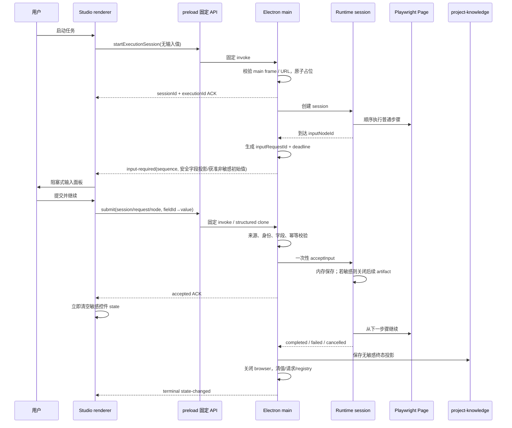

# vNext Runtime 输入会话、Electron IPC 与敏感值生命周期设计

> 状态：vNext-0 设计冻结候选 · 仅定义合同，当前代码尚未实现
>
> 日期：2026-08-24
>
> 适用范围：`@flowweave/runtime`、Electron Studio 主进程 / preload / renderer、`project-knowledge` 执行记录

## 1. 决策摘要

vNext 将现有“调用一次 `executeFlow()` 并等待终态”的执行模型升级为**由 Electron 主进程独占持有的内存会话**。Runtime 仍按 `steps[]` 顺序执行；遇到 `type: "input"` 的输入节点后保留同一个 Playwright `BrowserContext` 与 `Page`、停止推进步骤、发出一次性输入请求，收到 Studio 的合法提交后从该节点的下一步骤继续。

本设计冻结以下边界：

1. 公开会话状态为 `idle / running / waitingForInput / cancelling / completed / failed / cancelled`；`completed / failed / cancelled` 为不可逆终态。
2. `executionId` 是可持久化的运行记录身份；`sessionId` 是仅存内存的控制身份；`inputRequestId` 是一次性输入请求身份；`inputNodeId` 等于 DSL 输入节点的 `step.id`；提交值只以 `fieldId` 为键。
3. Electron 主进程是会话、Playwright 对象、输入请求与敏感值的唯一调度边界。renderer 永远拿不到 `Browser`、`BrowserContext`、`Page`、任意 IPC channel、任意文件路径或恢复 token。
4. 第一版每个 Studio 应用最多一个活跃会话、每个会话最多一个待处理输入请求；不支持关闭 Studio 后恢复等待会话，也不经 Local API / Web 暴露继续执行能力。
5. 敏感字段以 DSL 的 `sensitive: true` 显式声明，不再用变量名猜测。敏感值不得进入 Flow、默认值、版本、导出、日志、错误、普通历史、最近值、步骤诊断、截图元数据或 DOM/page snapshot。
6. Flow 只要声明任一敏感字段，整次运行从启动起禁用 HAR；第一次接受敏感值后，整次运行永久禁用后续截图、页面摘要与 DOM/page snapshot。第一版不提供“用户确认后仍采集”例外。
7. JavaScript 字符串、Electron structured clone 与 V8 GC 无法保证物理内存清零；实现只能缩短引用生命周期、禁止复制/持久化并在终态删除所有可达引用。产品与安全文档不得宣称已物理清零。

## 2. 当前实现映射与设计缺口

| 当前事实                                                                                  | 当前位置                                        | vNext 必须改变                                                                     |
| ----------------------------------------------------------------------------------------- | ----------------------------------------------- | ---------------------------------------------------------------------------------- |
| `executeFlow()` 返回单个 Promise，在 `for` 循环内顺序执行，`finally` 关闭 Playwright 会话 | `packages/runtime/src/playwright-runner.ts`     | 将浏览器资源与顺序游标放入可暂停的 Runtime session；仅在终态关闭                   |
| 进度只有 started / step / terminal，不含输入请求                                          | `packages/runtime/src/types.ts`                 | 增加状态事件与 `input-required` 安全投影；等待不计作已完成                         |
| AbortSignal 会触发会话关闭，取消结果可返回                                                | `packages/runtime/src/playwright-runner.ts`     | 保留 AbortSignal，并把等待 Promise、浏览器动作和关停 drain 统一纳入一次性取消      |
| Electron `runFlow` invoke 一直等到运行结束，active executions 为 Map                      | `apps/studio/electron/main.ts`                  | 启动命令立即返回会话 ACK；改为单活跃会话；输入提交和取消为固定命令                 |
| preload 暴露固定 API，但进度仅按固定 channel 广播给发起 sender                            | `apps/studio/electron/preload.ts`               | 继续固定 API，增加固定会话事件和安全快照；所有新命令校验 sender / main frame / URL |
| Studio UI 状态为 idle / running / terminal                                                | `apps/studio/src/shared/execution-progress.ts`  | 增加 `waitingForInput` 与取消中投影，按 sequence 丢弃旧事件                        |
| 执行上下文的 variables JSON 会被 SQLite 原样持久化                                        | `packages/project-knowledge/src/repository.ts`  | 按 field 元数据分流：敏感值绝不传给持久层；非敏感值也只按 remember 策略进入最近值  |
| 现有敏感判断依赖 `secret_` 名称并以 `[已隐藏]` 落历史                                     | `apps/studio/src/shared/sensitive-variables.ts` | v2 仅信任字段显式 `sensitive`；历史中不保存敏感字段键值对，不能只用占位符替代      |
| runtime 默认有 artifactDir 时记录 HAR、每个步骤截图并可写诊断                             | runtime / Studio services                       | 引入敏感感知的 artifact policy；诊断不得引用插值后的 step、locator、URL 或输入值   |

以上是源码事实与未来合同的映射，不代表 vNext 能力已经存在。

## 3. 身份、所有权与信任边界

### 3.1 身份定义

| 身份              | 生成方                                                    | 生命周期                                 | 是否持久化                  | 用途                                                         |
| ----------------- | --------------------------------------------------------- | ---------------------------------------- | --------------------------- | ------------------------------------------------------------ |
| `executionId`     | Electron 主进程                                           | 一次执行实例                             | 是                          | 运行目录、最终执行历史、用户诊断                             |
| `sessionId`       | Electron 主进程，128-bit 随机 UUID                        | 从启动 ACK 到终态清理                    | 否                          | 所有会话控制命令和事件绑定                                   |
| `inputRequestId`  | Electron 主进程收到 Runtime 的 input-node 信号后生成 UUID | 单次等待；提交、超时、取消任一发生即失效 | 否                          | 防止重复、迟到和错误节点提交                                 |
| `inputNodeId`     | Flow DSL                                                  | Flow 版本生命周期                        | 是，作为 Flow step id       | 对应 `type: "input"` 的节点；协议字段必须等于当前游标节点 id |
| `fieldId`         | Flow DSL                                                  | 字段跨重命名稳定身份                     | 是，值否                    | 输入值 Map 的唯一键，也是 `` 整值绑定身份       |
| `clientCommandId` | renderer，每次提交/取消生成 UUID                          | 命令去重窗口                             | 仅内存缓存 ID，不缓存输入值 | 实现幂等 ACK                                                 |

`sessionId` 不是认证凭据。调用是否可信只由 Electron 主进程对当前 `BrowserWindow`、`webContents`、main frame 和精确文档 URL 的校验决定；知道 ID 不能绕过来源校验。

### 3.2 单一所有权

- 主进程的 `ActiveInputSessionRegistry` 第一版只允许零或一个活跃会话。
- 会话绑定创建时的 `BrowserWindow.id` 与 `webContents.id`。事件只发送给该窗口；其他窗口即使拿到全部 ID 也不能读取或提交。
- renderer reload 不改变所属 `webContents` 时允许重新获取**安全快照**；renderer 进程崩溃、窗口关闭、所属窗口被替换均立即取消，不能转移所有权。
- Local API、Web 页面、扩展端不提供 start / submit / cancel / session snapshot 接口。
- Runtime 对外只接收纯数据命令和回调；Electron 不把 Playwright 对象穿过 preload。

### 3.3 IPC 来源校验

所有 vNext 会话命令在读取请求正文前先执行统一 `assertTrustedSessionCaller(event)`：

1. `event.sender` 必须等于当前主 Studio 窗口的 `webContents`。
2. `event.senderFrame` 必须存在、等于 `webContents.mainFrame`、`parent === null`。
3. `senderFrame.url` 必须精确等于主进程启动时解析并锁定的 renderer 文档 URL；生产为受控 `file:` URL，开发仅允许 `http://127.0.0.1:5173/`，不允许用户名、密码、其他 path、query 或 hash。
4. 窗口与 `webContents` 未 destroyed，且其 ID 与会话 owner 一致。
5. 校验失败只返回无底层细节的 `SESSION_CALLER_REJECTED`，不回显 session 是否存在。

事件通道固定为 `studio:execution-session-event`；preload 只暴露具名方法，不暴露 `send(channel, ...)`、`invoke(channel, ...)`、原始 `ipcRenderer`、EventEmitter 或 channel 枚举。

## 4. 规范状态机

### 4.1 状态定义

```typescript
type ExecutionSessionState =
  | "idle"
  | "running"
  | "waitingForInput"
  | "cancelling"
  | "completed"
  | "failed"
  | "cancelled";
```

`idle` 仅用于主进程已建立身份但尚未启动 Runtime 的极短阶段。启动 ACK 返回前，registry 已占位，因而并发启动不能同时越过单会话门禁。

### 4.2 状态转移表

| 当前状态                       | 触发                                              | 下一状态          | 必须动作                                                              |
| ------------------------------ | ------------------------------------------------- | ----------------- | --------------------------------------------------------------------- |
| 无会话                         | 合法 start，且 registry 空                        | `idle`            | 原子占位、生成 executionId/sessionId、写无敏感 crash sentinel         |
| `idle`                         | Runtime session 初始化成功                        | `running`         | 发 `session-started`；开始 step 0                                     |
| `idle`                         | 浏览器启动失败                                    | `failed`          | 安全错误码、关闭已创建资源、写终态记录、清 registry                   |
| `running`                      | 到达 input 节点                                   | `waitingForInput` | 生成 inputRequestId/deadline，只发字段定义，不发值；保持 page/context |
| `waitingForInput`              | 合法输入首次接受                                  | `running`         | 原子消费请求、提交内存 value store、完成 input 节点、从下一节点继续   |
| `waitingForInput`              | 15 分钟 deadline 到期                             | `failed`          | 失效请求，错误码 `INPUT_WAIT_TIMEOUT`，关闭资源                       |
| `idle/running/waitingForInput` | 合法 cancel / 窗口关闭 / app 退出 / renderer gone | `cancelling`      | Abort、拒绝新提交、清输入控件投影、开始 drain                         |
| `cancelling`                   | Runtime 停止并完成清理                            | `cancelled`       | 写取消终态，清 value store / 请求 / registry                          |
| `cancelling`                   | 10 秒 drain 到期                                  | `cancelled`       | 强制关闭 context/browser；记录非敏感 `CANCEL_FORCE_CLOSED` 诊断       |
| `running`                      | 所有节点完成                                      | `completed`       | 写成功终态、关闭资源、清所有内存引用                                  |
| `running`                      | step/runtime/resource 失败                        | `failed`          | 写安全错误码、关闭资源、清所有内存引用                                |
| 任一终态                       | 任意命令                                          | 不变              | 返回 `SESSION_TERMINAL`；不得复活                                     |

终态选择优先级：用户或生命周期取消已进入 `cancelling` 后，后续由 browser close 产生的错误不能把结果改成 `failed`；在取消前已原子提交的失败终态也不能改为 `cancelled`。状态只允许 compare-and-set 一次进入终态。

### 4.3 等待期间的 Playwright 语义

- 同一个非 detached `BrowserContext` 与 `Page` 由 Runtime session 持有；不会关闭、重建、导航或执行下一节点。
- 页面自身 JavaScript、计时器、网络和用户在 headed browser 中的手工操作仍可能改变页面。继续前 Runtime 必须重新验证 page/context 存活；失效则以 `RUNTIME_PAGE_LOST_WHILE_WAITING` 失败，不自动从头重跑。
- input 等待时间不使用当前单步 `timeoutMs`；固定 15 分钟，从 `input-required` 被主进程登记时开始，以主进程单调时钟裁决。事件中可给 renderer 展示绝对 `deadlineAt`，但本机时钟变化不影响裁决。
- 等待时禁止开始新 step、重试当前 input 节点、创建第二个请求或切换 Flow 版本。
- input 节点本身不操作网页，也不产生 screenshot/page snapshot。提交被接受后该节点才算成功完成。

## 5. 命令与事件合同

### 5.1 固定 preload API

```typescript
type StudioExecutionSessionApi = {
  startExecutionSession(request: StartExecutionSessionRequest): Promise<StartExecutionSessionAck>;
  submitExecutionInput(request: SubmitExecutionInputRequest): Promise<SubmitExecutionInputAck>;
  cancelExecutionSession(
    request: CancelExecutionSessionRequest,
  ): Promise<CancelExecutionSessionAck>;
  getActiveExecutionSession(): Promise<ExecutionSessionSnapshot | null>;
  onExecutionSessionEvent(listener: (event: ExecutionSessionEventEnvelope) => void): () => void;
};
```

启动命令必须在 registry 原子占位后立即返回 ACK，不能沿用当前等待整条 Flow 完成才返回的 `runFlow()` 语义。现有普通进度 API在 vNext 实施时并入会话事件；不能让两个通道分别成为状态真源。

### 5.2 命令伪接口

```typescript
type StartExecutionSessionRequest = {
  projectId: string;
  flowId: string;
  showBrowser: boolean;
  environmentName?: string;
  baseUrl?: string;
  storageStatePath?: string;
};

type StartExecutionSessionAck = {
  protocolVersion: 1;
  sessionId: string;
  executionId: string;
  state: "idle" | "running";
  sequence: number;
};

type InputSubmissionValue = string | number | boolean;

type SubmitExecutionInputRequest = {
  protocolVersion: 1;
  sessionId: string;
  executionId: string;
  inputRequestId: string;
  inputNodeId: string;
  clientCommandId: string;
  values: Record<string /* fieldId */, InputSubmissionValue>;
};

type SubmitExecutionInputAck = {
  accepted: true;
  duplicate: boolean;
  sessionId: string;
  inputRequestId: string;
  acceptedSequence: number;
};

// Electron main 校验并合并初始值后交给 Runtime 的内部合同；renderer 不能构造 sources。
type RuntimeInputSubmission = {
  inputNodeId: string;
  inputRequestId: string;
  values: Record<string /* fieldId */, InputSubmissionValue>;
  sources: Record<string /* fieldId */, "provided" | "default" | "lastValue">;
};

type CancelExecutionSessionRequest = {
  protocolVersion: 1;
  sessionId: string;
  executionId: string;
  clientCommandId: string;
};

type CancelExecutionSessionAck = {
  accepted: boolean;
  duplicate: boolean;
  state: ExecutionSessionState;
};
```

`startExecutionSession` 不携带 v2 输入字段值；即使迁移后的 input 节点在首部，也必须到节点后走同一输入请求协议。这样敏感值不会混入启动参数、运行配置、最近值恢复或启动失败错误。

### 5.3 事件 envelope

```typescript
type ExecutionSessionEventEnvelope = {
  protocolVersion: 1;
  sessionId: string;
  executionId: string;
  sequence: number; // 从 1 单调递增，session 内唯一
  emittedAt: string; // ISO 8601，仅展示；顺序以 sequence 为准
  event:
    | { type: "session-started"; totalSteps: number }
    | {
        type: "step-started";
        stepIndex: number;
        stepId: string;
        stepType: string;
        completedSteps: number;
        totalSteps: number;
        currentAction: string;
      }
    | {
        type: "input-required";
        inputRequestId: string;
        inputNodeId: string;
        stepIndex: number;
        completedSteps: number;
        totalSteps: number;
        deadlineAt: string;
        node: SafeInputNodeProjection;
      }
    | {
        type: "input-accepted";
        inputRequestId: string;
        inputNodeId: string;
        stepIndex: number;
        resolvedFields: Array<{
          fieldId: string;
          source: "provided" | "default" | "lastValue";
        }>;
      }
    | {
        type: "step-finished";
        stepIndex: number;
        stepId: string;
        stepStatus: "success" | "failed";
        completedSteps: number;
        totalSteps: number;
      }
    | { type: "state-changed"; state: ExecutionSessionState; reasonCode?: SafeSessionReasonCode };
};

type SafeInputNodeProjection = {
  name: string;
  description?: string;
  fields: Array<{
    fieldId: string;
    label: string;
    description?: string;
    placeholder?: string; // 仅 UI 提示元数据，不参与取值或提交
    type: "string" | "number" | "boolean";
    required: boolean;
    sensitive: boolean;
    initialValue?: string | number | boolean;
    initialValueSource?: "default" | "lastValue";
  }>;
};
```

`placeholder` 来自当前已校验 Flow，只是可持久化的 UI 提示元数据，不能作为字段值、required 判定或 Runtime fallback。

主进程在登记 `input-required` 时为每个字段生成一次安全初始值投影，优先级固定为：

1. 字段 `sensitive=false`、`remember="lastValue"`，且 project-knowledge 存在同 fieldId、同类型、通过当前字段 schema 的最近值时，使用该值并标记 `initialValueSource="lastValue"`；
2. 否则字段 `sensitive=false` 且当前编译 Flow 有合法 `defaultValue` 时，使用该值并标记 `initialValueSource="default"`；
3. 否则不携带 `initialValue` 与 `initialValueSource`。

两字段必须同时出现或同时缺失；敏感字段无论本地数据中是否存在异常旧记录，都永远不得出现两字段，主进程还应清理/隔离该非法最近值记录。无效或类型不匹配的普通最近值不参与预填，并按损坏数据处理后回退到合法 default 或 absent。`initialValue` 是作者通过 DSL 策略明确允许的**非敏感候选输入**，不是已提交值。

renderer 提交时可覆盖初始值；省略字段时，主进程只可合并本次 request 投影中仍有效的 initialValue。主进程生成内部 `RuntimeInputSubmission` 后，Runtime 再按当前 inputNodeId/fieldId/type/required/default 独立校验 values，并核对 sources：敏感或 `remember:never` 字段不得标 lastValue、无 DSL default 的字段不得标 default、sources 与 values 的 fieldId 集合必须完全一致。Runtime 不信任 renderer 声明来源，也不读取 project-knowledge。来源判定只看提交 DTO 是否显式含该 fieldId：省略并合并 initialValue 时保持 `default` 或 `lastValue`，显式提交时一律记为 `provided`，即使值恰好相同。

waiting 状态的安全 snapshot 可以重放同一 request 的 `placeholder/initialValue/initialValueSource`，使 renderer reload 恢复获准的非敏感预填。它不得包含用户尚未提交的编辑草稿、任何敏感值、其他执行实例中未获 `remember:lastValue` 授权的值或已经接受的提交值。input ACK、取消、超时或任一终态后，主进程删除该请求的初始值投影，renderer 同步清空控件；reload 后只会恢复规范初始值，不恢复 reload 前的手工编辑。

### 5.4 顺序、幂等与迟到响应

1. 主进程在改变规范状态后分配 sequence，再发送事件；事件发送失败不回滚状态。
2. renderer reducer 只接受同 session 且 `sequence > lastSequence` 的事件。事件丢失时，以 `getActiveExecutionSession()` 的安全快照重新同步；事件 envelope 不是审计日志。
3. 每个 inputRequestId 只允许一次**不同 clientCommandId 的首次接受**。主进程在调用 Runtime 前原子标记请求为 `accepting`，因此双击、并发 invoke 只有一个能写 value store。
4. 同一 `clientCommandId` 的重试只返回首次 ACK，`duplicate: true`；去重缓存只存 ID、请求结果和 sequence，不存 values、序列化正文或值摘要。使用同一 ID 发送不同正文仍按重复处理并忽略新正文。
5. 首次请求已接受后，新的 clientCommandId 返回 `INPUT_REQUEST_ALREADY_RESOLVED`；超时返回 `INPUT_REQUEST_EXPIRED`；inputRequestId/inputNodeId/sessionId 任一不匹配均拒绝且不泄露正确值。
6. 取消状态一经进入，所有尚未开始的提交返回 `SESSION_CANCELLING`；取消完成后返回 `SESSION_TERMINAL`。已经原子接受的提交可以完成内存写入，但取消优先阻止下一 step 启动并立即清理。
7. 跨窗口、子 frame、旧 renderer、旧 session 或旧 Flow 节点的提交全部拒绝。

一个输入节点的关键事件顺序固定为：`step-started` → `input-required`（该事件本身原子表示状态已变为 `waitingForInput`）→ `input-accepted` → `step-finished(success)` → `state-changed(running)` → 下一节点的 `step-started`。取消时先发 `state-changed(cancelling)`，资源清理完成后再发唯一 `state-changed(cancelled)`；等待超时时先发 input 节点的 `step-finished(failed)`，再发唯一 `state-changed(failed, INPUT_WAIT_TIMEOUT)`。启动使用 `session-started` 原子表示已进入 `running`，不再为同一转移另发重复状态事件。

### 5.5 backpressure

- 第一版全应用只允许一个活跃 session、每个 session 一个 pending input request；第二次 start 返回 `SESSION_BUSY`。
- renderer 在 `submitExecutionInput()` Promise 未决时禁用“提交并继续”，主进程仍必须独立防重复。
- step 进度允许主进程按 100ms 窗口合并纯展示更新，但 `input-required`、`input-accepted`、所有 state change 与终态不可丢弃或合并。
- 主进程只保留最新安全 snapshot，不保存事件历史，也不为离线 renderer 排队。renderer 缺席时事件可以丢失，snapshot 始终是真源。
- renderer reload 采用“先注册固定 listener，再拉 snapshot”的顺序，并按 sequence 合并；这消除订阅与快照之间的丢事件竞态。

## 6. 输入校验合同

主进程与 Runtime 必须各自使用共享 schema 校验，不能信任 renderer 或只校验一层：

1. DTO 仅允许白名单字段、plain object、无 getter/setter；sessionId/inputRequestId/clientCommandId 必须是规范 UUID，executionId 使用现有 execution resource validator，inputNodeId/fieldId 必须同时匹配当前已编译 Flow 与 DSL v2 的 `input_` / `field_` 身份规则。IPC 不另造一套与 DSL 冲突的 ID 正则。
2. `values` 最多 50 项，与 DSL 单输入节点上限一致；每个 key 必须是当前请求 fields 中的 fieldId，禁止额外字段、重复语义或按 name 提交。
3. string 单字段最多 16 KiB，所有 string 总计最多 64 KiB；number 必须 finite；boolean 必须是真布尔值；禁止对象、数组、null、BigInt、NaN 和 Infinity。
4. required 字段的最终有效值必须存在；第一版 required string 经 trim 后必须非空。主进程只能用当前 input request 的获准 `initialValue` 合并省略字段，Runtime 再以已编译 DSL 独立校验最终值；renderer 不能提交或覆盖 DSL 之外的默认定义。敏感字段从结构上没有默认值或最近值，必须由用户本次显式提供。
5. 敏感字段只能绑定 `fill.value`；Runtime 编译阶段若发现它绑定 navigate/url、target、wait、selector、文件路径或其他面，整条 Flow 在浏览器启动前以 `FLOW_SENSITIVE_BINDING_FORBIDDEN` 拒绝。
6. Runtime 根据当前已编译节点的 fieldId/type/required 再校验一次；主进程投影和 Runtime 定义不一致时 fail closed 为 `INPUT_CONTRACT_MISMATCH`。
7. 用户可见错误只含字段 label 或 fieldId 与稳定错误码，不回显值、不拼接底层异常和 stack。

## 7. 敏感值端到端生命周期

### 7.1 生命周期表

| 阶段          | 允许行为                                                                                         | 禁止行为                                                                                                               | 清理时点                                                                                                          |
| ------------- | ------------------------------------------------------------------------------------------------ | ---------------------------------------------------------------------------------------------------------------------- | ----------------------------------------------------------------------------------------------------------------- |
| Studio 控件   | 密码型遮罩；本次请求内 React 局部 state；按策略预填获准的非敏感 initialValue；仅显示“已提供”摘要 | 敏感默认/最近值、未经 `remember:lastValue` 许可的回填、剪贴板自动复制、local/sessionStorage、URL、全局 store、调试日志 | invoke 获得 accepted ACK 后立即清空；取消、超时、unmount 同样清空；reload 只恢复规范 initialValue，不恢复编辑草稿 |
| preload       | 固定函数接收 plain DTO，经 structured clone invoke 一次                                          | 缓存、日志、事件回发正文、通用 IPC、DevTools bridge                                                                    | invoke settle 后删除局部引用；不做重试队列                                                                        |
| Electron main | 来源校验、schema 校验、一次性转交 Runtime                                                        | stringify、console、crash sentinel、错误 cause、telemetry、去重正文缓存、project-knowledge                             | Runtime 接受后删除 DTO 引用；终态/取消/窗口关闭清整个会话 store                                                   |
| Runtime       | 内存 `Map<fieldId, value>`；仅在执行绑定点即时解析                                               | 构造可持久化 resolved Flow、在错误/诊断中记录 resolved step/locator/url、跨 session 复用                               | 字段最后一个消费节点完成后可提前 delete；最迟终态 finally 全清                                                    |
| Playwright    | 仅在 `fill.value` 调用期间把值交给页面                                                           | console 采集、trace、HAR、含值截图/DOM snapshot、把值写入 target/url                                                   | Playwright action 返回后释放局部引用；context 终态关闭                                                            |
| persistence   | 只保存字段定义、fieldId、input node step 状态和非敏感 remember 许可值                            | 敏感 fieldId→值映射、占位符值、输入请求正文、等待会话恢复数据                                                          | 不适用；敏感值从未进入持久层                                                                                      |

### 7.2 artifact policy

```typescript
type RuntimeArtifactPolicy = {
  recordHar: boolean;
  captureScreenshot: boolean;
  capturePageSnapshot: boolean;
  captureDomSnapshot: boolean;
  includeResolvedDiagnosticValues: false;
};

type RuntimeArtifactSafety = {
  policyVersion: 1;
  flowHasSensitiveFields: boolean;
  sensitiveValueAccepted: boolean;
  harCaptured: boolean;
  sensitiveAcceptedAtStepIndex?: number;
};
```

- 编译 Flow 时只要发现任一 `sensitive: true` 字段，`recordHar` 从执行开始强制为 `false`，调用方不能覆盖。
- 第一次敏感输入被原子接受后，session 设置不可逆 `sensitiveValueAccepted = true`；从该时刻起 screenshot、page snapshot、DOM snapshot 全部为 false，直到终态。已经存在的前置截图可以保留，因为敏感值尚未进入会话；input 节点自身不采集产物。
- 第一版不承诺 HAR/screenshot/DOM 的内容级脱敏，不提供用户 opt-in 绕过。未来只有经过独立验证的脱敏管线和新 ADR 才能改变该默认值。
- 错误与诊断在所有情况下都不得包含插值后的 step、locator、URL、target hints 或输入值。诊断使用模板 fieldId、stepId、strategy kind/ordinal、稳定 cause category；页面 URL 只允许独立安全策略产出的 origin 级摘要，否则省略。
- screenshot 元数据、文件名和运行目录不得含字段名、fieldId 或值。
- Runtime 终态结果的物理字段 `artifactSafety` 必须携带上述无值结构化策略声明。它是可与 Flow、HAR path 和 step artifact refs 交叉校验的元数据，不是“内容中绝无秘密”的证明。主进程和 project-knowledge 根据 Flow 重新计算预期策略，并执行：`flowHasSensitiveFields=true` 时 `harCaptured` 必须为 false 且 harPath 必须 absent；`sensitiveValueAccepted=true` 时必须有 `sensitiveAcceptedAtStepIndex`，该 stepIndex 当步及之后的 screenshot/page/DOM refs 必须 absent；字段组合与 Flow 或实际 refs 矛盾时整条执行拒绝落盘。拒绝持久化不能替代源头禁采；若磁盘上实际出现禁用产物，运行按安全失败处理、产物进入受控隔离/清理并触发 P0 canary 泄露测试失败，不能把路径写入普通历史。

### 7.3 普通历史与最近值

- `project-knowledge` 接收前由可信主进程基于当前 Flow 字段定义构造 allowlist。敏感字段的**值映射**必须完全 omit，不能写 `[已隐藏]` 键值占位。执行历史可以保存无值来源元数据 `{inputNodeId, fieldId, source: "provided" | "default" | "lastValue"}` 与 input 节点 step 状态，用于解释输入来自何处；它不能保存值、值摘要、长度、哈希、最近值记录 ID 或值比较细节。
- `remember: "never"` 的非敏感值同样不进最近值；`remember: "lastValue"` 的非敏感值才可进入专用最近值投影。普通执行详情默认只显示“某输入节点已完成、字段数”，不显示值。
- Flow snapshot 可以保存 `sensitive` 元数据和绑定 token ``，但绝不保存运行值。
- storageStatePath、baseUrl 等现有上下文继续按既有策略处理；若未来允许输入字段影响它们，必须另行安全设计，第一版禁止该绑定面。

### 7.4 物理清零限制

V8 字符串不可变，Electron invoke 会 structured-clone，浏览器页面也会持有填入值；因此 `delete map[fieldId]`、设局部变量为 `undefined` 或清空 React state 只能缩短引用生命周期，不能证明底层内存被覆写。实现验收口径是：

1. 不主动序列化或持久化。
2. 不保留跨阶段缓存、闭包、重试正文或诊断引用。
3. 终态 `finally` 删除所有应用可达引用并关闭 BrowserContext。
4. 文档与 UI 只承诺“不落普通历史且尽快释放”，不承诺安全内存或物理擦除。

## 8. 进度与步骤日志语义

- `totalSteps` 包含 `input` 节点。
- 到达 input 节点发 `step-started`，随后发 `input-required` 并进入 waiting；此时 `completedSteps` 不增加。
- 合法提交被 Runtime 接受后，依次发 `input-accepted`、input 节点 `step-finished(success)`、状态回到 running；`completedSteps` 加一，从 `stepIndex + 1` 继续，不重跑此前步骤。
- 等待超时：input 节点 step log 为 failed，只含 `INPUT_WAIT_TIMEOUT`；取消：该节点为 skipped/cancelled 投影，不含字段和值。
- `currentAction` 只能使用固定安全文案，例如“等待你填写输入节点”“正在继续执行”；不得拼接 node description、field label 之外的网页数据。
- 输入字段是否已收集的 UI 摘要只用 `resolvedFields` 与字段定义重建“已提供”，不携带值。最终普通历史若保存该状态，也只能使用上一节的 fieldId/source 无值元数据。
- session 的 sequence 是 UI 状态顺序真源；时间戳不参与覆盖判断。

## 9. 生命周期与故障矩阵

| 场景                              | 裁决                                       | 用户结果                                    | 清理与持久化                                                                                                       |
| --------------------------------- | ------------------------------------------ | ------------------------------------------- | ------------------------------------------------------------------------------------------------------------------ |
| 重复点击提交，同 clientCommandId  | 幂等接受一次                               | 第二次显示已处理，不再继续第二次            | 不复制 values；只保留去重 ID/ACK                                                                                   |
| 同请求不同 clientCommandId 再提交 | 拒绝                                       | 输入请求已处理                              | 不修改 runtime store                                                                                               |
| 迟到提交                          | 拒绝 `INPUT_REQUEST_EXPIRED`               | 提示请求已过期，运行已失败                  | 清控件与请求，不恢复                                                                                               |
| inputNodeId / inputRequestId 不符 | fail closed                                | 请求不再有效                                | 不说明正确 ID，不触碰会话                                                                                          |
| 其他窗口/iframe 提交              | `SESSION_CALLER_REJECTED`                  | 通用拒绝                                    | 不泄露 session 存在性                                                                                              |
| 运行中取消                        | 进入 cancelling                            | 显示取消中→已取消                           | Abort 当前 action、10s drain、关闭 context、清值                                                                   |
| 等待输入时取消                    | 失效 request 后取消                        | 面板关闭并显示已取消                        | 清 renderer 与 main/runtime 值、关闭 context                                                                       |
| input 等待 15 分钟                | failed                                     | 输入等待超时                                | 无值历史；关闭资源                                                                                                 |
| page 在等待时被用户关闭           | 继续前检测失败                             | 页面已关闭，运行失败                        | `RUNTIME_PAGE_LOST_WHILE_WAITING`，清 session                                                                      |
| renderer reload                   | 同一 webContents 的受信 URL 重载时会话继续 | 重新显示安全 snapshot；恢复获准非敏感初始值 | 不恢复编辑草稿、敏感值或已提交值；registry 继续占位，旧 renderer 事件可丢失                                        |
| renderer crash / OOM / killed     | 立即取消                                   | 重开后显示上一运行意外中止                  | Abort + close；不允许新 renderer 接管旧 session                                                                    |
| renderer clean-exit 后未重载      | 5 秒受控重连窗口到期后取消                 | 显示 renderer 已断开                        | 只允许同 webContents + 受信 main frame 重连；超时走同一 cancel path                                                |
| Studio 窗口关闭                   | 阻止关闭，先取消并 drain；完成后关闭       | 不支持稍后恢复                              | 10s 后强制 close；终态 cancelled                                                                                   |
| app quit                          | 拒绝新 start，取消并等待活跃会话           | 正常退出                                    | drain 最多 10s，停止本地服务后退出                                                                                 |
| Electron 主进程崩溃               | 会话丢失，不恢复                           | 下次启动标记“上次运行意外中止”              | 非 detached Playwright 应随 pipe 断开退出；下次启动核对 crash sentinel、清受控临时 profile并写 `MAIN_PROCESS_LOST` |
| 浏览器/context 自行崩溃           | failed                                     | 浏览器会话中断                              | 关闭剩余资源，清值，安全错误码                                                                                     |
| project-knowledge 保存终态失败    | failed 且告知记录未保存                    | 运行结果无法完整保存                        | 仍必须先清敏感值与浏览器，不以重试缓存保存正文                                                                     |
| 事件发送失败                      | session 继续                               | reload 后从 snapshot 恢复安全状态           | 不缓存输入值；终态照常清理                                                                                         |

### 9.1 crash sentinel

实施阶段在受控 run directory 写最小 sentinel，仅含 `protocolVersion/executionId/projectId/flowId/startedAt/state="active"`，不含 sessionId、inputRequestId、fieldId、变量、URL 或环境配置。正常终态先写执行记录，再原子删除 sentinel。下次启动只在已验证属于 FlowWeave run directory、普通文件、非符号链接且大小受限时读取；发现残留即将该执行投影为 `failed/MAIN_PROCESS_LOST`，不尝试恢复浏览器或输入。

主进程崩溃无法执行 `finally`，因此“浏览器一定退出”必须由故障注入证据证明。Chromium 必须以非 detached 子进程启动；若 crash 测试发现孤儿进程，vNext-2A 不得通过，不能用不安全的宽泛 PID 扫描掩盖问题。

## 10. 错误分类

```typescript
type SafeSessionReasonCode =
  | "SESSION_BUSY"
  | "SESSION_CALLER_REJECTED"
  | "SESSION_NOT_FOUND"
  | "SESSION_CANCELLING"
  | "SESSION_TERMINAL"
  | "INPUT_REQUEST_NOT_ACTIVE"
  | "INPUT_REQUEST_ALREADY_RESOLVED"
  | "INPUT_REQUEST_EXPIRED"
  | "INPUT_REQUEST_ID_MISMATCH"
  | "INPUT_NODE_ID_MISMATCH"
  | "INPUT_SUBMISSION_INVALID"
  | "INPUT_CONTRACT_MISMATCH"
  | "INPUT_WAIT_TIMEOUT"
  | "FLOW_SENSITIVE_BINDING_FORBIDDEN"
  | "RUNTIME_PAGE_LOST_WHILE_WAITING"
  | "RUNTIME_RESOURCE_CLOSED"
  | "RUNTIME_STEP_FAILED"
  | "CANCEL_FORCE_CLOSED"
  | "RENDERER_GONE"
  | "WINDOW_CLOSED"
  | "APP_QUITTING"
  | "MAIN_PROCESS_LOST"
  | "EXECUTION_PERSIST_FAILED";
```

分类规则：

- 安全/身份错误不暴露正确身份、Flow 内容或 active session 状态。
- 输入校验错误只返回 code、fieldId 或安全 label，不返回值。
- Runtime 错误面向 renderer 使用稳定 code + 固定中文说明；底层 stack 只允许进开发期 stderr，且必须经过禁止输入值与 resolved step 的结构化日志适配器。生产默认不输出底层 cause。
- `cancelled` 是用户或生命周期动作的终态，不与 `failed` 混用；等待超时属于 failed。

## 11. 时序



## 12. 关闭、重载与恢复策略

### 12.1 renderer reload

reload 不等于关闭 Studio。主进程保持 session；新 renderer 订阅固定事件后读取 `ExecutionSessionSnapshot`。快照包含 session/execution id、state、lastSequence、进度、当前安全 input node 投影和 deadline。若正在 waiting，它可以恢复本次 request 明确获准的非敏感 `initialValue` 与 `initialValueSource`，但不含敏感值、renderer 编辑草稿或已经接受的提交值；若刚提交成功则显示 running 且不再带 input projection。

实现必须区分正常 reload 与 renderer 异常退出：

- 同一个 `webContents` 导航到已锁定的精确 renderer URL 属于 reload，owner 不转移。
- `render-process-gone` 的 reason 为 crashed、oom、killed、integrity-failure 或其他异常时立即取消。
- reason 为 clean-exit 时，只保留 5 秒重连窗口；必须由同一个 webContents 的受信 main frame 完成加载并调用安全 snapshot，才能继续。超时取消。重连窗口内 registry 仍被占用，不能启动第二会话。
- 任何新 BrowserWindow、新 webContents、子 frame 或不同 URL 都不能借 reload 接管会话。

### 12.2 窗口关闭与应用退出

- 窗口 close handler 在会话活跃时 `preventDefault()`，触发取消并等待 drain；清理完成后才真正 destroy。
- app `before-quit` 设置全局 shuttingDown，拒绝新 start，取消会话并等待至 10 秒；随后强制关闭 Runtime 资源、关闭 local API，再退出。
- renderer 的“取消运行”与窗口/app 生命周期取消共用同一幂等 cancel path。

### 12.3 明确不支持的恢复

关闭窗口、退出 Studio、renderer crash/OOM/killed、clean-exit 重连超时或主进程崩溃后，等待输入会话一律不能恢复。不会为恢复目的把 sessionId、inputRequestId、page 状态、renderer 草稿、请求投影或 continuation token 落盘。只有独立的非敏感 `remember:lastValue` 策略可以按字段保存最近值，它不能恢复原 session、request 或页面。用户只能重新启动执行实例；此前终态记录为 cancelled 或 failed。

## 13. 测试合同

### 13.1 Runtime 单元/集成测试

1. 红灯：input 节点会暂停 for-loop，提交前下一步从未执行；提交后只执行 `stepIndex + 1`，此前步骤不重跑。
2. 红灯：等待期间 page/context 保持同一对象；完成、失败、取消均只关闭一次。
3. 重复提交、并发提交、迟到提交、错 session/request/node/field 全部 fail closed。
4. input wait 使用 15 分钟独立 timer；fake clock 验证 deadline、取消 timer 和 timeout 终态。
5. 取消 running/waiting/accepting 各竞态只产生一个终态，取消优先级符合状态表。
6. 敏感字段绑定到非 `fill.value` 在浏览器启动前拒绝。
7. 含 sensitive Flow 时 HAR 从启动禁用；首次敏感值接受后后续截图/page/DOM snapshot 为零；`artifactSafety` 的五个字段与 Flow、harPath、step refs 一致。
8. 失败诊断 JSON、StepLog、ExecutionResult 和 emitted events 对 canary secret 全仓断言不包含明文、编码值、resolved locator/url。
9. main 合并 initialValue 后，Runtime 仍拒绝缺失 required、类型错误、额外 fieldId 和敏感字段默认/最近来源；Runtime 不访问 project-knowledge。
10. 进度：waiting 时 completedSteps 不增加；input accepted 后增加一次；sequence 严格递增。
11. page 在等待时关闭、browser crash、Abort 和 close 失败故障注入均释放资源。

### 13.2 Electron main / preload 测试

1. main frame、子 frame、错误 origin、旧 webContents、第二窗口分别验证允许/拒绝；拒绝信息不泄露 session。
2. preload 表面快照测试证明只有五个具名能力，无原始 ipcRenderer 和动态 channel。
3. 单活跃会话并发 start 只有一个成功；占位在浏览器 async 初始化前完成。
4. clientCommandId 幂等缓存不持有 values；同 ID 不同正文被忽略。
5. initialValue 固定按合法 lastValue → defaultValue → absent；未授权 remember、类型损坏或任何 sensitive 字段都不会预填；placeholder 永不参与取值。
6. renderer reload 的 listener+snapshot 竞态按 sequence 收敛；waiting 只恢复规范 initialValue，不恢复编辑草稿、敏感值或已提交值。
7. input ACK、取消、超时、终态均从 main snapshot 与 renderer state 删除 initialValue；下一 input request 不继承上一请求投影。
8. `render-process-gone`、window close、before-quit 触发同一 cancel path，10 秒强制清理可测试。
9. 发送事件失败、窗口 destroyed 不影响终态持久化和 finally。
10. normalize DTO 覆盖额外 key、原型、getter、超长字符串、字段数量、NaN/Infinity/对象等攻击输入。
11. Local API 不存在 session start/submit/cancel route；Web fallback 不能获得这些方法。

### 13.3 persistence 与泄露回归

先用构造结果验证持久化门禁：篡改 policyVersion、把 sensitive Flow 声明成无敏感、把 harCaptured 设为 true、缺少 cutoff stepIndex、或在 cutoff 当步及之后注入任一 screenshot/page/DOM ref 时，project-knowledge 必须整条拒绝且不留下半条执行记录。最近值存储还必须证明每个非敏感 `remember:lastValue` 字段最多一行、类型按当前 schema 复核，sensitive 或 remember:never 字段永远无值行。

使用唯一 canary secret 贯穿一次成功、失败、取消、超时、renderer crash、main crash 故障流程，递归扫描：

- SQLite 全表和 WAL/SHM；
- run directory 的 HAR、PNG、JSON、diagnostic、sentinel；
- console 捕获、renderer 错误、主进程错误；
- Execution API / Studio history / 最近值；
- Flow snapshot、版本和导出 JSON。

任何命中即为 P0 安全失败。JS heap 物理残留不在可证明承诺内，但 heap snapshot 不应发现由应用主动缓存、队列、闭包或历史模型保留的 canary 引用。

### 13.4 真机/E2E

1. 线性 Flow → input → 填敏感值 → fill → 后续步骤成功，浏览器/page 未重建。
2. 同一模板开头输入与中途输入均可执行；普通字段分别验证 lastValue、defaultValue 和 absent 预填优先级，敏感字段始终为空。
3. waiting 时 reload renderer 只恢复规范 initialValue；用户 reload 前编辑但未提交的值丢弃，已接受提交不回显。
4. 等待时用户关闭 page、关闭 Studio、退出 app、reload renderer、强杀 renderer 的行为与矩阵一致。
5. 主进程 crash 故障注入后无 Chromium 孤儿；下次启动正确消费 sentinel，不能恢复输入。
6. headed 与 headless 都通过；Node 20/24 矩阵保留。

## 14. 后续实施拆分与门禁

```text
vNext-2A Runtime session 内核
  ├─ 状态机 / 游标 / input port / Abort / resource owner
  ├─ artifact policy 与安全诊断
  └─ Runtime 红灯测试全部转绿
          ↓
vNext-2B Electron 会话桥
  ├─ 单会话 registry / 固定 IPC / 来源校验 / 幂等
  ├─ window / quit / renderer gone / crash sentinel
  └─ Electron 安全测试全部转绿
          ↓
vNext-3B Studio 运行态输入
  ├─ waitingForInput reducer / 输入面板 / sequence 恢复
  ├─ 控件清理 / 不回填 / 可访问性
  └─ Studio 交互测试全部转绿
          ↓
vNext-4 纵向 E2E 与泄露扫描
```

每阶段必须独立提交、可回滚：

- 2A 未接 UI 前以 Runtime 测试驱动，不替换现有 v1 `executeFlow` 路径。
- 2B 通过新 IPC capability flag 灰度；旧 v1 Flow 继续走现有一次性运行。
- 3B 只在 schema v2 且 capability 可用时启用；异常时拒绝执行，不能静默降级为运行前大表单。
- vNext-4 PASS 前不删除旧路径、不开放多会话、不允许敏感 artifact 例外。

## 15. 安全裁决与非目标

### 15.1 security-review 设计自检

本候选已把以下安全硬门禁写入规范与测试合同：固定 IPC、来源与所有权校验、双层输入验证、一次性请求、单会话 backpressure、敏感字段显式元数据、敏感值不持久化、artifact fail closed、终态清理与故障注入。本轨是设计 Generator，无权批准自身；最终 PASS / REVISE / REJECT 必须由独立 Judge 按可定位证据作出。任一泄露扫描、跨窗口提交、资源残留或主进程 crash 孤儿测试失败都必须阻止后续实施验收。

### 15.2 明确非目标

- 关闭 Studio 后恢复等待节点；
- 多窗口接管、跨设备继续、云会话或 Local API 远程提交；
- 多活跃会话、并行分支、循环、子流程；
- 敏感值托管、钥匙串保存、敏感默认值或敏感最近值；
- 内容级 HAR/screenshot/DOM 脱敏；
- renderer 直接控制 Browser/Page；
- 任意表达式、混合插值或敏感 locator/url 参数化。
